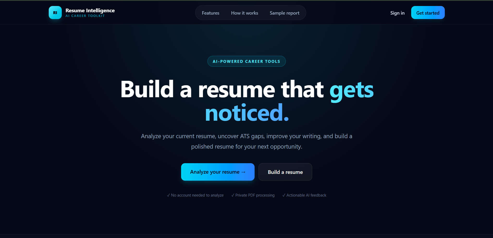
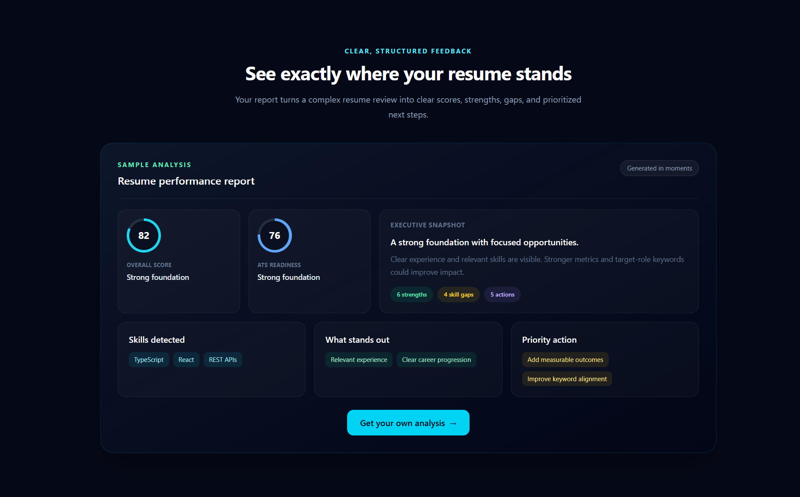
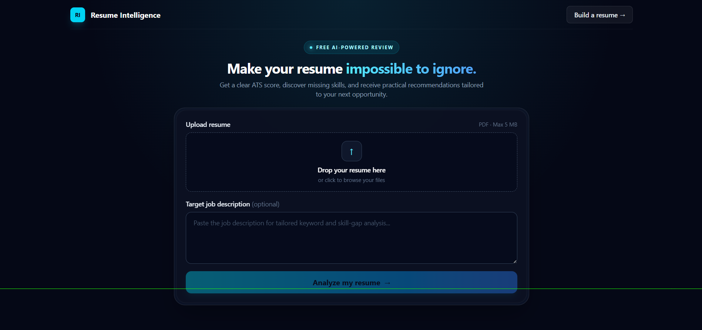

# Resume Intelligence

Resume Intelligence is a full-stack SaaS application for analyzing, improving, building, and exporting professional resumes. AI requests and credentials stay exclusively on the NestJS backend.

## Features

- Public PDF resume analysis with ATS scoring, skill gaps, strengths, weaknesses, and recommendations
- AI-powered PDF import that converts an existing resume into editable builder data
- JWT registration and login
- Authenticated resume CRUD with collapsible sections, custom sections, reordering, and a real-time preview
- AI-assisted summaries, experience bullets, skills, descriptions, and ATS reviews
- Secure A4 PDF generation and download
- Strict request validation, structured error responses, rate limiting, security headers, health checks, and OpenAPI documentation

## Product tour

### Landing page and primary workflows

The landing page directs visitors to either the public resume analyzer or the authenticated resume builder while explaining the product's privacy and AI-assisted workflow.



### Structured resume analysis

The sample report demonstrates overall and ATS scores, detected strengths, skill gaps, and prioritized actions before a user uploads their own resume.



### PDF analyzer

The public analyzer accepts a PDF up to 5 MB and an optional job description, then produces role-aware resume feedback without requiring an account.



## Technology

- Frontend: React 19, Vite, TypeScript, Tailwind CSS, React Router, TanStack Query
- Backend: NestJS, Prisma, PostgreSQL, JWT, Multer, PDFKit, Groq-compatible OpenAI SDK
- Operations: Docker Compose, Nginx, Swagger/OpenAPI

## Repository structure

```text
resume-intelligence/
|-- frontend/          React application and Nginx configuration
|-- backend/           NestJS API, Prisma schema, and migrations
|-- docker-compose.yml
|-- .env.example
`-- README.md
```

## Local development

Requirements: Node.js 22+, npm, and either a PostgreSQL database URL or Docker Desktop.

1. Install dependencies and create the environment file:

   ```bash
   npm install
   cp .env.example .env
   ```

   On Windows PowerShell, use `Copy-Item .env.example .env`.

2. Set `DATABASE_URL`, a random `JWT_SECRET` of at least 32 characters, and `GROQ_API_KEY` in `.env`. Never commit this file.

3. When using the included local PostgreSQL container:

   ```bash
   docker compose up -d postgres
   ```

   This step is unnecessary when `DATABASE_URL` points to Neon or another hosted PostgreSQL service.

4. Generate Prisma Client and apply migrations:

   ```bash
   npm run db:generate
   npm run db:migrate
   ```

5. Start the applications in separate terminals:

   ```bash
   npm run dev:backend
   npm run dev:frontend
   ```

Development URLs:

- Frontend: `http://localhost:5173`
- API: `http://localhost:3000/api`
- Swagger UI: `http://localhost:3000/docs`
- Health check: `http://localhost:3000/api/health`

## Environment variables

| Variable | Purpose | Example |
|---|---|---|
| `PORT` | Backend HTTP port | `3000` |
| `FRONTEND_URL` | Allowed browser origin | `http://localhost:5173` |
| `DATABASE_URL` | PostgreSQL connection URL | `postgresql://...` |
| `JWT_SECRET` | JWT signing secret, minimum 32 characters | random secret |
| `GROQ_API_KEY` | Server-only Groq credential | provider API key |
| `GROQ_MODEL` | Groq model identifier | `openai/gpt-oss-120b` |
| `RESEND_API_KEY` | Server-only Resend credential for password-reset email | provider API key |
| `EMAIL_FROM` | Verified password-reset sender | `Resume Intelligence <no-reply@example.com>` |
| `PASSWORD_RESET_EXPIRY_MINUTES` | Password-reset link lifetime | `30` |
| `VITE_API_URL` | Public frontend API base URL | `http://localhost:3000/api` |

Frontend variables are embedded at build time and must never contain secrets. Rotate any credential that has been pasted into chat, logs, or committed history.

## Useful commands

```bash
npm run build                         # Build frontend and backend
npm test                              # Run backend unit tests
npm run db:generate                   # Generate Prisma Client
npm run db:migrate                    # Apply/create development migrations
npm run db:studio                     # Open Prisma Studio
npm run prisma:deploy --workspace backend  # Apply committed production migrations
```

## API overview

All routes use the `/api` prefix. Protected routes require `Authorization: Bearer <token>`.

- `GET /health` - API and database readiness
- `POST /auth/register`, `POST /auth/login`, `GET /auth/me`
- `POST /analysis/resume` - public multipart PDF analysis; field `resume`, optional `jobDescription`, 5 MB limit
- `POST /resumes/import` - authenticated multipart PDF import returned as editable structured resume data
- `GET|POST /resumes`, `GET|PUT|DELETE /resumes/:id`
- `POST /resumes/:id/improvements/{summary|experience|skills|ats|description}`
- `GET /resumes/:id/export/pdf`

Validation rejects unknown properties. Errors use a consistent JSON shape containing `statusCode`, `message`, `error`, `path`, and `timestamp`. Swagger provides the complete generated route catalog at `/docs`.

## Docker deployment

The Compose stack builds the React/Nginx frontend and NestJS backend, starts PostgreSQL, waits for health checks, and applies committed Prisma migrations before the API starts.

```bash
cp .env.example .env
# Replace JWT_SECRET and GROQ_API_KEY before continuing.
docker compose up --build -d
docker compose ps
```

Open `http://localhost:8080`. The Nginx container proxies `/api` to the backend. To inspect services:

```bash
docker compose logs -f backend
docker compose down
```

Database data remains in the `postgres_data` volume. `docker compose down -v` permanently removes it and should only be used when that deletion is intended.

## Production deployment

1. Provision managed PostgreSQL and set its TLS-enabled `DATABASE_URL`.
2. Store `JWT_SECRET` and `GROQ_API_KEY` in the hosting platform's secret manager.
3. Build the supplied Dockerfiles or run `npm run build` with Node.js 22.
4. Apply migrations with `npm run prisma:deploy --workspace backend` during release.
5. Serve the frontend over HTTPS and set `FRONTEND_URL` to its exact public origin.
6. Route frontend `/api` requests to the backend and monitor `/api/health`.
7. Configure platform-level request limits, logs, backups, and secret rotation.

Do not use development defaults in production. Do not expose PostgreSQL publicly unless the hosting architecture explicitly requires it.

## Security notes

- LLM prompts and API keys exist only on the backend.
- Passwords are hashed with bcrypt and authentication uses expiring JWTs.
- Resume ownership is checked for reads, updates, deletion, AI improvements, and PDF export.
- Uploaded PDFs are processed in memory and raw files are not persisted.
- Helmet security headers, CORS allowlisting, strict DTO validation, and global rate limiting are enabled.

The production dependency audit currently reports an upstream `deepmerge-ts` advisory through Prisma's configuration tooling. Resume Intelligence does not merge user-controlled recursive objects through Prisma configuration, and the affected package is not part of an HTTP request path. Prisma 7.9.1 is currently the latest compatible release and still pins the affected dependency; keep Prisma current and remove this exception when a patched compatible release is published.

## Development phases

1. Monorepo initialization
2. Database and backend foundation
3. JWT authentication
4. Public AI resume analyzer
5. Resume builder
6. AI resume improvements
7. PDF export
8. Production hardening and documentation
